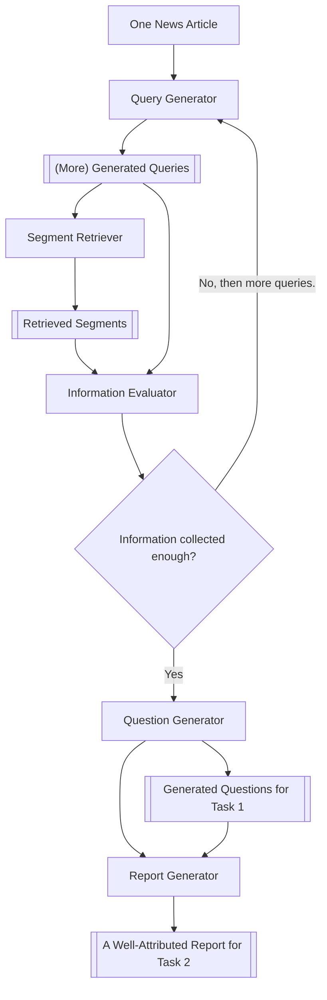

## Ollama Setup
This version has been modified to work with Ollama instead of OpenAI's API.

1. Install Ollama: [installation instructions]
2. Download required models: `ollama pull <model-name>`
3. Update `.env` configuration

# TREC 2025 DRAGUN Starter Kit

This repository is a starter kit for the [**TREC 2025 DRAGUN Track**](https://trec-dragun.github.io/) - *Detection, Retrieval, and Augmented Generation for Understanding News*. It provides a baseline multi-agent system to help readers evaluate the trustworthiness of online news articles. The system automatically generates investigative **questions** (for Task 1) and a well-attributed **report** (for Task 2) for each news article, using an iterative retrieval-augmented generation pipeline, overall architecture shown below. Participants can use this kit as a starting point - either by using the intermediate data or by modifying and improving components for their own approaches.



## Quick Start

Follow these steps to get up and running quickly with the starter kit:

1. **Clone the Repository**:
    ```bash
    git clone https://github.com/trec-dragun/2025-starter-kit.git
    cd 2025-starter-kit
    ```
2. **Set Up a Python Environment**: Ensure you have **Python 3.10+** (tested with Python 3.12). It’s recommended to use a virtual environment (venv or conda). For example:
    ```bash
    python3 -m venv venv
    source venv/bin/activate
    ```
3. **Install Dependencies**: Install the required Python packages. You can use `pip` as follows:
    ```bash
    pip install tqdm python-dotenv openai pydantic sentence-transformers pyserini
    ```
4. **Configure API Keys and Paths**:
    - Copy the example environment file: `cp .example.env .env`.
    - Open the newly created `.env` file and fill in the required configurations:
        - **OpenAI API Key** for the language model (if using OpenAI’s API).
        - **INDEX_PATH** for the MS MARCO V2.1 segmented index (see next step).
5. **Download the MS MARCO Index** (required for segment retrieval): The system uses the MS MARCO V2.1 (Segmented) web collection. A pre-built Lucene index is available via Pyserini. Download and extract it (this file is large):
    ```bash
    wget https://rgw.cs.uwaterloo.ca/pyserini/indexes/lucene/lucene-inverted.msmarco-v2.1-doc-segmented-full.20240418.4f9675.tar.gz
    tar -xvf lucene-inverted.msmarco-v2.1-doc-segmented-full.20240418.4f9675.tar.gz
    ```
    After uncompressing, update the `INDEX_PATH` in your `.env` to point to the directory of the extracted index.
6. **Run the Pipeline**: Once everything is set up, run the main script to execute the pipeline on the sample topics: `python main.py`. This will process the news articles (topics). Run `produce_run.py` to produce outputs for both tasks. 
7. **Inspect the Outputs**: After running, you should find:
    - A file `output/tracking_data.json` – containing intermediate data (queries issued, segments retrieved, etc. for each article).
    - Submission-ready output files in the `output/` folder, for example:
        - `dragun-organizers-starter-kit-task-1` – a TSV file with top 10 questions for each article (Task 1 output).
        - `dragun-organizers-starter-kit-task-2` – a file containing the generated report for each article (Task 2 output).
    
    You can open and examine these files to see what the starter kit produced. 

That’s it! 🎉 You have quickly set up the starter kit and run a basic end-to-end example. In the following sections, we explain the system in more detail and how you can customize it.

## System Architecture

The core of this starter kit is a **multi-agent pipeline** that iteratively gathers information and decides when enough has been collected to generate the final outputs.

**How it works**: For each news article (topic), the system goes through the following steps:
- **Query Generator**: Takes the input article and generates a set of search queries that might lead to useful background information. It starts with an initial 5 queries based on the article content. Then, as new information comes in, it can generate more queries (5 at a time) in subsequent iterations. These queries aim to cover different aspects of the article's credibility (e.g., checking source reputation and alternative viewpoints).
- **Segment Retriever**: For each query, the retriever finds relevant text segments from the MS MARCO V2.1 segmented web corpus. It performs a two-stage retrieval:
    - **First-stage retrieval** using [Pyserini](http://pyserini.io/) (BM25 with relevance feedback RM3) to get an initial list of candidate segments.
    - **Re-ranking** using a dense bi-encoder model (from [Sentence-Transformers](https://sbert.net/)) to prioritize the most relevant segments among the candidates.
    - **LLM filtering**: Finally, a large language model (LLM) component evaluates the top-ranked segments and selects the **three most relevant segments** for the current query. These segments are considered the most useful pieces of information retrieved for that iteration.
- **Information Evaluator**: This component takes all information gathered so far – the article, the queries issued, and the retrieved segments – and decides whether we have collected enough evidence and context for the article. If **insufficient information** is present (for example, if important questions remain unanswered or key aspects of the article haven't been investigated), the evaluator signals the system to loop back and generate **more queries** (returning to the Query Generator step). The loop then continues with new queries and retrievals, enriching the information pool.
- This iterative **query→retrieve→evaluate** loop repeats until the Information Evaluator determines that the information is sufficient (or a predefined limit is reached). At that point, the pipeline proceeds to output generation.
- **Question Generator**: Using the compiled information (the article itself and all retrieved evidence), this module generates the list of top 10 questions for Task 1. These questions highlight the most critical issues one should investigate about the article's content and context. The questions are ranked by importance.
- **Report Generator**: This final stage uses the gathered evidence to produce a well-attributed report (Task 2 output), guided by the generated questions from the previous step. 

Throughout this pipeline, **intermediate data** is logged. For example, every query generated and every segment retrieved (and whether it was selected) is recorded. This trace is saved in `tracking_data.json`. Participants can examine this to understand the system's decision process or reuse some of this data in their own approaches. 