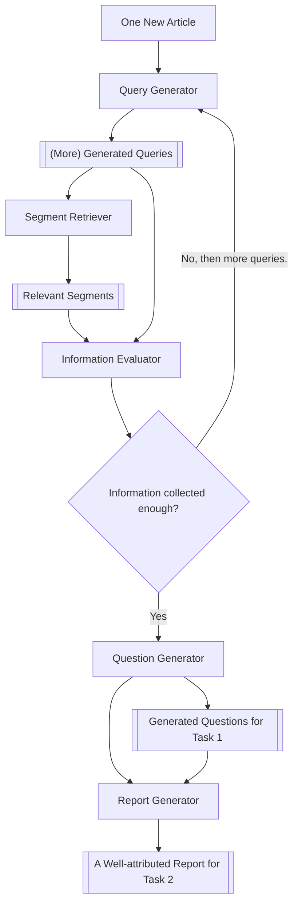

# TREC 2025 DRAGUN Starter Kit

This starter kit is designed for the [TREC 2025 DRAGUN (*Detection, Retrieval, and Augmented Generation for Understanding News*) Track](https://trec-dragun.github.io/). It provides a multi-agent system that assists users in evaluating the trustworthiness of online news articles through an iterative process involving query generation, segment retrieval, and information evaluation. The system produces generated questions for Task 1 and well-attributed reports for Task 2. Participants are encouraged to utilize the intermediate data, extend this system, or develop their own solutions. The pipeline architecture is illustrated below:



## Getting Started

- This code has been tested with Python 3.12 and is expected to work with Python 3.10 and later versions.
- The following packages are required:
    - `tqdm`
    - `python-dotenv`
    - `openai`
    - `pydantic`
    - `sentence-transformers`
    - `pyserini`

- The `/modules` folder contains the code files for each agent:
    - `query_generator.py`: Given a news article, this module produces five initial search queries. In subsequent iterations, it generates five additional queries based on the article, previously generated queries, retrieved segments, and evaluation from the `Information Evaluator`.
    - `segment_retriever.py`: Given a news article and a query, this module retrieves relevant segments from the `MS MARCO V2.1 (Segmented)` dataset. The retrieval process involves:
        1. First-stage retrieval using [Pyserini](http://pyserini.io/)'s BM25 with RM3.
        2. Dense ranking using [Bi-Encoder](https://sbert.net/examples/sentence_transformer/applications/retrieve_rerank/README.html).
        3. An LLM selects the three most relevant segments.
    - `information_evaluator.py`: Given a news article and a list of queries with their retrieved segments, this module determines if sufficient information has been collected for a reader to assess the trustworthiness of the news article. If not, it triggers the `Query Generator` to produce more queries.

- **Environment Setup**:
    1. Copy the `.example.env` file to a new file named `.env`.
    2. Fill in the necessary API keys and configurations in the `.env` file.

- **Running the Pipeline**:
   To execute the main pipeline, run the following command in your terminal:
   ```bash
   python main.py
   ```

- `tracking_data.json` provides the intermediate data generated by the system. This includes issued queries, retrieved segments from `MS MARCO V2.1 (Segmented)`, and other relevant information that participants can utilize.
